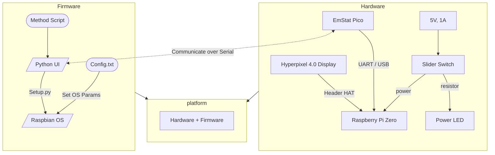
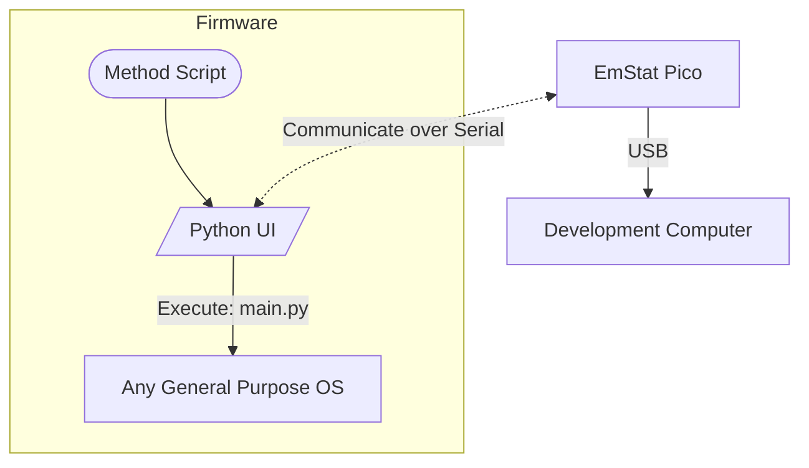
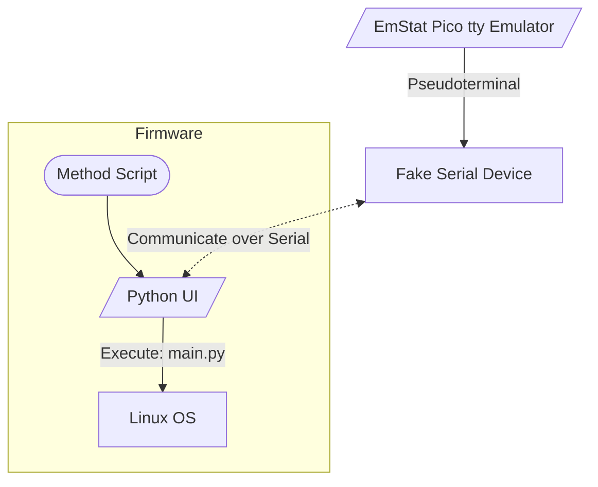
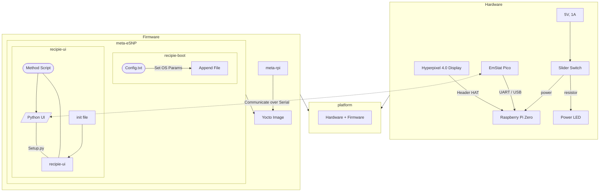

# eSNP Detector v1

We present an eSNP detection instrument. This instrument uses electrochemical sensing in order to detect conjugation of target ssDNA with predefined molecular probes.

## Objective
- Interface with an [EmStat Pico](https://www.palmsens.com/product/oem-emstat-pico-module/) to conduct predefined Electrochemical sensing protocols.
- Provide a simple end-user facing UI for conducting SNP detection tests

## UI for HMI


## TODOs
- [ ] v1: single SNP detection using electrochemical sensing
- [ ] v2: Add **Melting Curve Analysis** (MCA) to the electrochemical sensing
- [ ] v3: Add 16-way multiplexing
- [ ] v4: Add 16-way multiplexing along with 16 MCA channels

# Working Principle


# Build Instrunctions

> It is recommended to `pipenv` to manage dependencies and creation of a virtual environment for the project. Useful for developemnt.

```bash
$ pipenv run python main.py

Or,

$ pipenv shell
$ python main.py
```

## Dependencies
### Hardware 
- Raspberry Pi Zero
- Hyperpixel 4.0
- EmStat Pico Module
- 3 terminal Slider Switch (Optional)
- Green LED (Optional)
- A rate limiting resistor for LED (Optional)
- A DC Power Jack (Optional)

### Software
- python 3.8
- pipenv
- `pyqt5`
- [`palmsens (internal)`](https://github.com/PalmSens/MethodSCRIPT_Examples/tree/master/MethodSCRIPTExample_Python/MethodSCRIPTExample_Python/palmsens)


# System Components Diagram


## Development Environment [Not Implemented]


## Test Environment [Not Implemented]


## Production Environment [Not Implemented]


## EmStat Communcation Diagram

